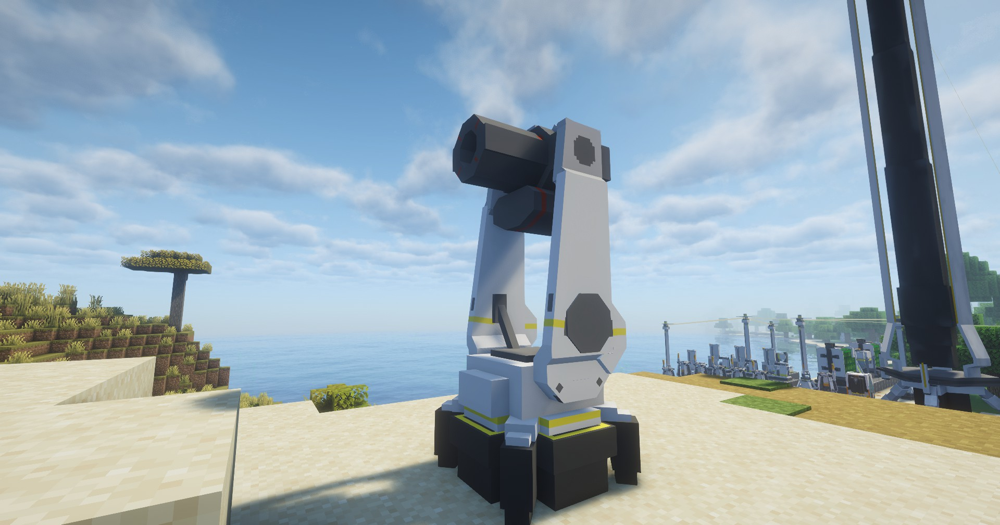

---
sidebar_position: 10
---
# 高爆榴弹塔 / He Grenade Tower

能造成高能爆炸伤害；

Can cause high energy explosion damage;

## 画廊 / Gallery

## 信息 / Information
- 高爆榴弹塔`需要电力`才能工作，耗电量为`20 EFU`；

  He Grenade Tower needs power to work, power consumption is `20 EFU`;

- 攻击力： `55`；

  攻击范围： `12.5`m；

  攻击间隔：`3`s；
  
- ATK: `55`;

  Attack Range: `12.5`m; 

  Attack Interval: `3`s;

## Tips
暂时还不能使用电池充能；

动画全部由代码驱动；

Now can't use battery to charge; 

All animations are driven by code;

## 技术性说明 / Technical Explanation
攻击方式为无实体攻击，即攻击链路并不是传统的`发射实体（子弹）-> 命中目标 -> 造成伤害`

而是直接由塔防设备对范围内的敌对生物造成伤害，用粒子模拟攻击轨迹；

同时，在攻击实体前，塔防设备会取消受击生物的受击后伤害免疫（PHDI），以此适配多塔防设备的高频攻击；

The attack method is non-entity attack, that is, the attack link is not traditional `shoot entity (bullet) -> hit target -> cause damage`

But instead, the tower defense device directly causes damage to enemy biologicals within the range, using particles to simulate the attack trajectory;

At the same time, before attacking the entity, the tower defense device will cancel the PHDI of the hit biological, which adapts to the high frequency attack of multiple tower defense devices;