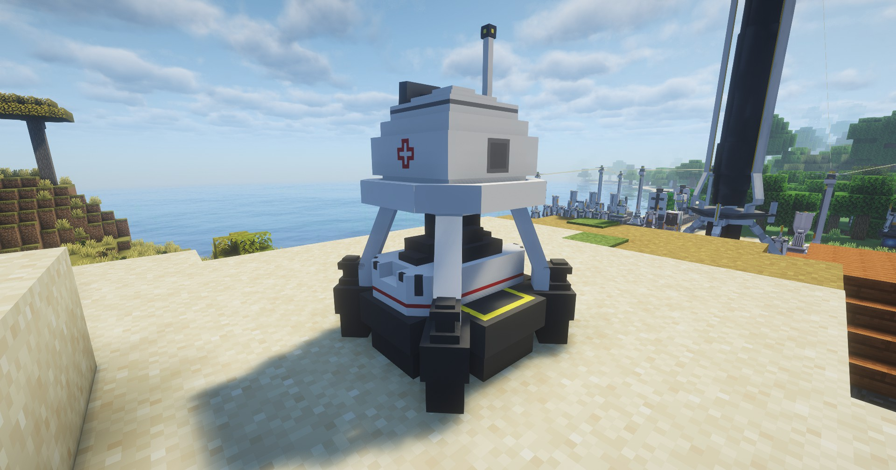

---
sidebar_position: 2
---
# 医疗塔 / Medical Tower

基础治疗设备；

Basic treatment equipment;

## 画廊 / Gallery

## 信息 / Information
- 医疗塔`需要电力`才能工作，耗电量为`5 EFU`；

  Medical Tower needs power to work, power consumption is `5 EFU`;

- 治疗量： `5`；

  治疗范围： `6`m；

  治疗间隔：`5`s；
  
- Treatment: `5`;

  Treatment Range: `6`m; 

  Treatment Interval: `5`s;

## Tips
暂时还不能使用电池充能；

Now can't use battery to charge;