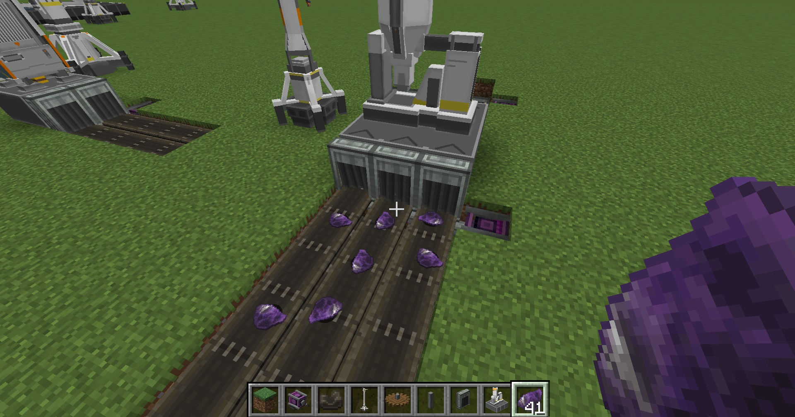
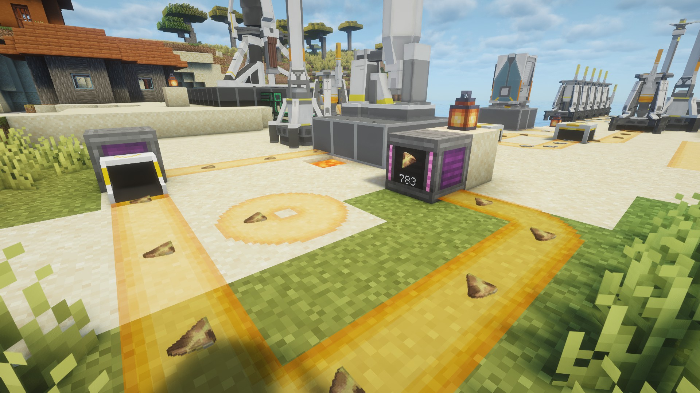
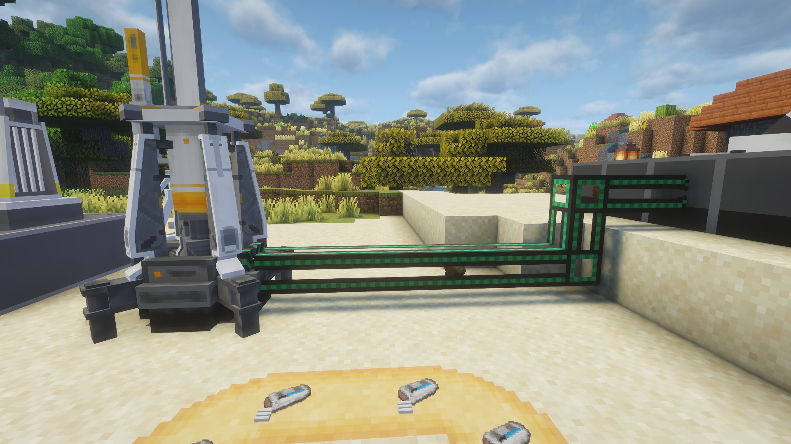

# 模组介绍 Mod Introduction

## 终末地工业 / Endfield Industry
*(非官方明日方舟：终末地 二创模组)*

*Arknights: Endfield - Minecraft Fan Mod*

**注意：模组的部分代码使用`生成式人工智能(AI)`编写，此篇文章的英文翻译也由AI翻译**

**Note: Some code of this mod is written using AI, and the English translation of this article is also translated by AI**

## 简介 / Introduction
本模组为个人开发的 **非商业同人作品**，灵感来源于《明日方舟：终末地》。  
旨在以 Minecraft 的形式探索终末地的工业与生态设计理念。

This is a **non-commercial fan-made project** inspired by *Arknights: Endfield*,  
reimagined in the Minecraft universe.

---

## 授权信息 / License

> 本模组的源代码和美术资源全部采用 All Rights Reserved 许可
>
> This mod's source code and art assets are licensed under All Rights Reserved.
>
> 涉及《明日方舟：终末地》原作内容的相关版权归鹰角网络所有。
>
> The copyright of the content related to the original work of "Arknights: Endfield" belongs to Hypergryph.

对整合包作者 / For ModPack Author:

> 可根据整合包内容对本模组进行魔改，但不得发布二次修改后的模组，且不得将本模组用于商业用途。
>
> Modification of this mod is permitted, but not allowed to release modified versions, and must not be used for commercial purposes.

---

## 非官方声明 / Disclaimer
- 本模组与 **鹰角网络（Hypergryph）** 及《明日方舟：终末地》官方无关；
- This mod is not affiliated with Hypergryph or Arknights: Endfield.
- 仅供玩家学习、研究与非商业娱乐使用；
- This mod is for players to learn, research, and enjoy for non-commercial purposes only.
- 禁止以任何形式用于商业用途、付费分发或盈利活动；
- Prohibited for any form of commercial use, paid distribution, or profit activities.
- 若原版权方提出要求，本模组将立即下架。
- If the copyright holder requests, this mod will be immediately withdrawn.

---

## 模组依赖 / Dependencies
### Fabric 1.20.1
- Fabric Loader >= 0.16.14
- Fabric API >= 0.92.6
- Geckolib >= 4.7.1.2

### Forge 1.20.1
- Forge Loader >= 47.4.0
- Geckolib >= 4.7.3

### NeoForge 1.21.1
- NeoForge Loader >= 21.1.215
- Geckolib >= 4.8.2

---

## 模组联动 / Mod Compat
- `REI`：Fabric 1.20.1
- `JEI`：Forge 1.20.1 / NeoForge 1.21.1

其他 / Other：

在`Forge`和`NeoForge`的版本中，你可以使用其他工业模组的物流系统，因为模组采用`Capability`编写物品传输逻辑；

In `Forge` and `NeoForge` versions, you can use the logistics system of other industrial mods, because the mod uses `Capability` to write the item transfer logic.

For Example:

机械动力 / Create

通用机械 / MEK

---

## 关于 / About
- 这是一个将游戏`《明日方舟：终末地》`中的集成工业设施加入到`Minecraft`中的模组
- 使用这个模组，让你在`Minecraft`也能成为`管理员`！

- This is a mod that adds the Integrated Industries facilities from the game "Arknights: Endfield" into "Minecraft".
- With this mod, you can become an "Endministrator" in "Minecraft"!

---

## 玩法提示 / Playing Tips
- 参见后面的文章
- See the articles below for more details

---

## 联系方式 / Contact
- 作者 / Author：`北山_Besson / Beishan_Besson`  
- Fabric Ver. Repo：`https://github.com/BeiShanair/Arknights-Endfield-1.20.1-fab`
- Forge Ver. Repo：`https://github.com/BeiShanair/Arknights-Endfield-1.20.1-for`
- NeoForge Ver. Repo：`https://github.com/BeiShanair/Arknights-Endfield-1.21.1-Neoforge`

---

## 未来 / Future
- 本模组目前仍在开发中
- This mod is still under development
