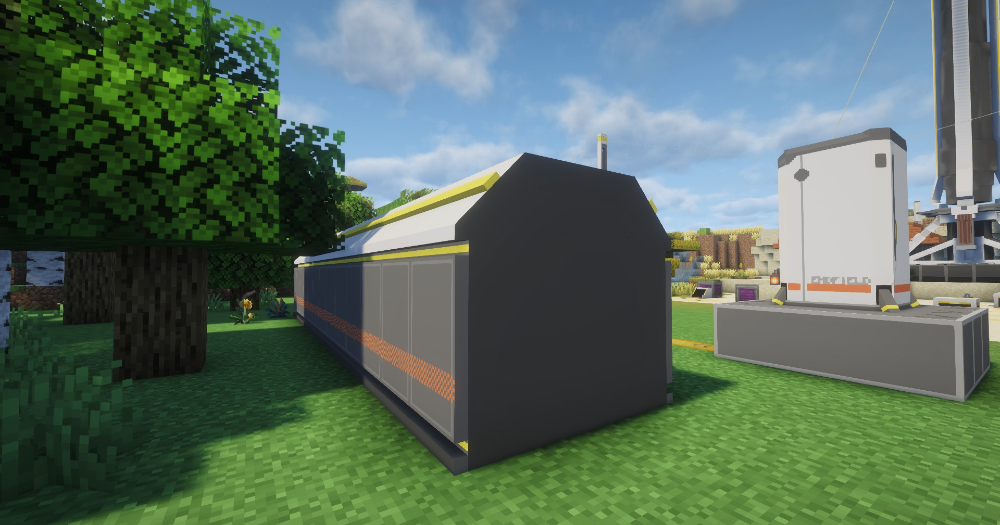

---
sidebar_position: 7
---

# 仓库存取线基段 / Depot Bus Section
仓库总线，供取货口、存货口使用

Depot bus for pick-up and inventory ports

## 画廊 / Gallery

## 信息 / Information
- 本身不需要消耗电力，没有放置范围限制，也就是放哪里都可以

  It does not consume electricity, and there is no limit to the placement range, that is, it can be placed anywhere

- 区别于原作单个基段有着`8×4`的大小，模组中的基段进行了拆分，单个大小只有`1×3`，可让玩家自定义更多形式

  Different from the original single base segment with a size of '8×4', the base segment in the mod is split, and the single size is only '1×3', allowing players to customize more forms

- `仓库取货口`、`仓库存货口`需要贴着它放置才能工作

  The `Depot Unloader` and `Depot Loader` need to be placed on it to work

## Tips
- 可通过`制造台`制作，相关介绍见[制作台](../production1/crafter.md)；

  It can be made through the Crafter, see [Crafter](../production1/crafter.md) for details;

- 放置`仓库存取线基段`需要`1×3`的空地

  Placing a Depot Bus Section requires an empty `1×3` area
