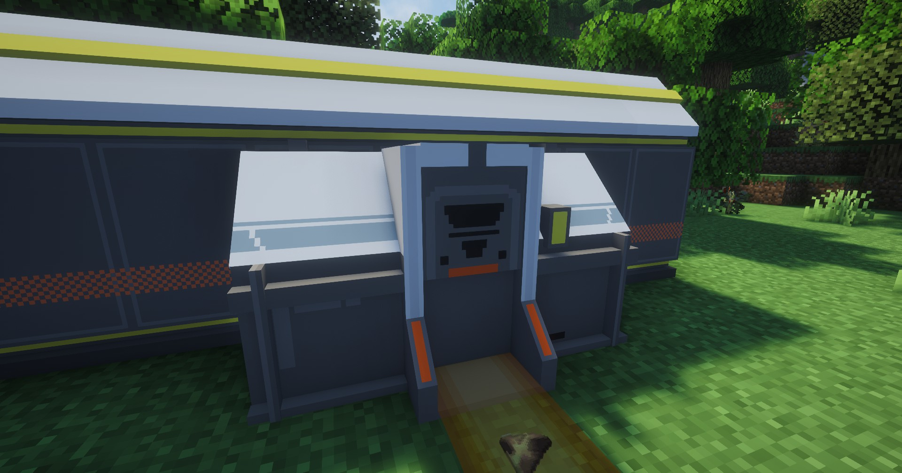

---
sidebar_position: 8
---

# 仓库存货口 / Depot Loader
用于向仓库提交物品的接口

It is used to submit items to the Storage

## 画廊 / Gallery

## 信息 / Information
- 本身不需要消耗电力，需要贴着`仓库存取线基段`放置才能工作

  It does not consume electricity, you need to place it on the `Depot Bus Section` to work

- 区别于`仓库取货口`，它上方的颜色标识为青灰色

  The difference between `Depot Loader` and `Depot Unloader`, the color above is blue gray

## Tips
- 可通过`制造台`制作，相关介绍见[制作台](../production1/crafter.md)；

  It can be made through the Crafter, see [Crafter](../production1/crafter.md) for details;

- 放置`仓库存货口`需要`3×1`的空地

  Placing a Depot Loader requires an empty `3×1` area

## 技术性说明 / Technical Explanation
自身没有`tick`逻辑，提交逻辑由且只能由本模组的[传送带](belt.md)触发 ，所以目前暂不能和其他工业模组联动，敬请谅解

It does not include `tick` logic; its actions are triggered solely by the [conveyor belt](belt.md) within this mod. As a result, it is currently unable to interact with other industrial mods. We appreciate your understanding.
