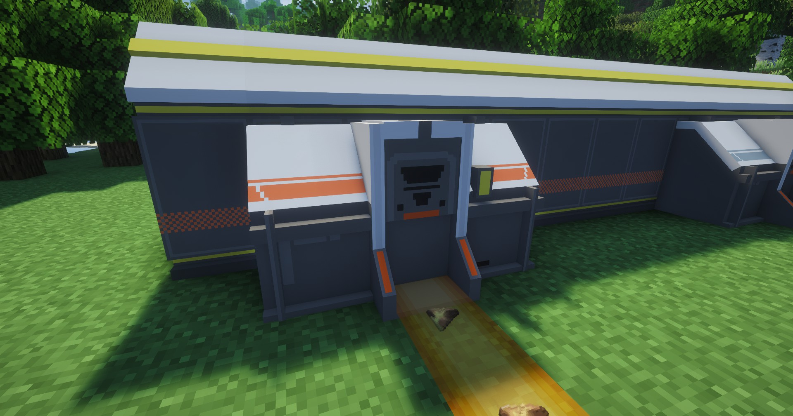

---
sidebar_position: 9
---

# 仓库取货口 / Depot Unloader
用于向仓库拿取物品的接口

It is used to take items from the depot

## 画廊 / Gallery

## 信息 / Information
- 本身不需要消耗电力，需要贴着`仓库存取线基段`放置才能工作

  It does not consume electricity, you need to place it on the `Depot Bus Section` to work

- 右键打开它的GUI，放入一个物品，可设置该物品为输出物品，然后取货口就可以工作了

  Right-click to open its GUI, put in an item, set the item as an output item, and the unloader will work

- 区别于`仓库存货口`，它上方的颜色标识为橙红色

  The difference between `Depot Unloader` and `Depot Loader`, the color above is orange red

## Tips
- 可通过`制造台`制作，相关介绍见[制作台](../production1/crafter.md)；

  It can be made through the Crafter, see [Crafter](../production1/crafter.md) for details;

- 放置`仓库取货口`需要`3×1`的空地

  Placing a Depot Unloader requires an empty `3×1` area

## 技术性说明 / Technical Explanation
设置输出物品后，会自动向且只能向本模组的[传送带](belt.md)输送物品 ，所以目前暂不能和其他工业模组联动，敬请谅解

Once items are set as outputs, they will automatically be sent exclusively to this mod’s [Conveyor Belt](belt.md). As a result, integration with other industrial mods is currently not supported. We appreciate your understanding.
