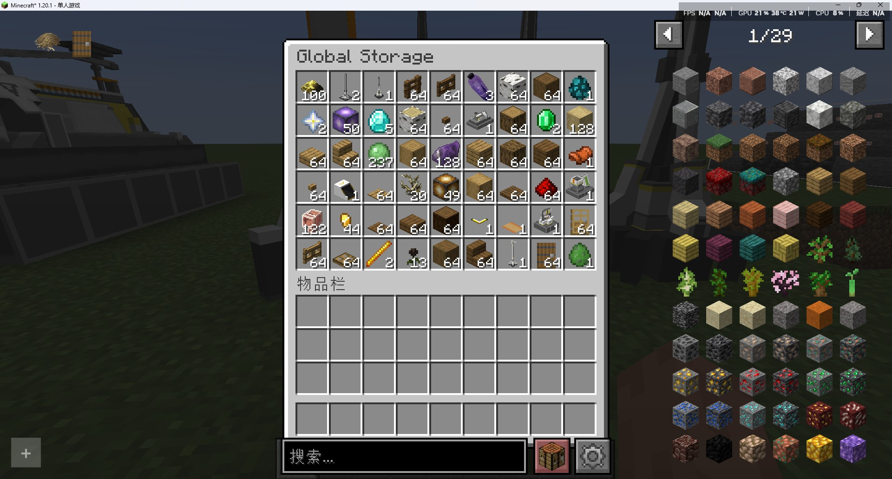

---
sidebar_position: 5
---

# 全局仓储管理系统 / Global Storage Manger

单例模式，负责整个世界的仓库存取

Singleton mode, responsible for the entire world

## 画廊 / Gallery

*Global Storage Manager GUI*

## 信息 / Information
- 该系统在一个世界上只存在一个实例，不依赖`tick`运行，本身只维护一个`Map`

  This system only exists one instance in a world, does not depend on `tick` to run, itself only maintains a `Map`

- `仓库取货口`、`仓库存货口`、`协议储存箱`能够有效工作时，会与它直接联系

  `Depot Unloader`, `Depot Loader`, `Protocol Stash` can work together and contact with it directly when working
- 系统按照`维度`区分仓库，也就是一个维度一个仓库，各自独立

  The system is distinguished by dimension, which is a dimension a warehouse, each independently

- 每种物品只占用一个槽位

  Each item only occupies one slot

- 理论上只要是物品就可以存入，且仓库可设置的最大上限为`long`类型的最大值，默认为`10000`

  Theoretically, any item can be stored, and the maximum upper limit of the warehouse is the maximum value of the long type, default is 10000

## Tips
- 点击GUI中的物品槽，可取出该物品到玩家的物品栏，`左键`获得1个，`右键`获得该物品最大堆叠上限数量的物品

  Clicking on the item slot in the GUI, the item can be taken out to the player's inventory, `left click` to get 1 item, `right click` to get the maximum stack limit of the item

- 不过还不能直接存入物品，可以通过`协议储存箱`存入物品，或通过指令

  However, you cannot directly store items, you can store items through the `Protocol Stash` or through the command

## GUI
- 有一个与该系统绑定的`GUI`界面，默认绑定的按键是`G`

  There is a GUI interface bound to the system by default, the bound key is G

- 显示界面与原版的大箱子一致，显示`54`个物品槽位，可用`鼠标滚轮`滚动查看未展示的物品

  The display interface is consistent with the original big chest, displaying `54` item slots, available to use `mouse wheel` to scroll through unseen items

- 数量显示文本做了单独处理，`1000`将显示为`1k`，`1000000`将显示`1M`，后面的暂时没处理，悬浮文本将显示确切数量

  The number display text is processed separately, `1000` will be displayed as `1k`, `1000000` will be displayed as `1M`, and the rest is not processed temporarily, the hover text will display the exact number

## 指令 / Command
- 有三条与该系统关联的指令`/storage`，使用方法见下方

  There are three commands associated with the system `/storage`, use the method see below

### 存入物品 / Deposit
```
/storage deposit <物品名称/Item Name> <数量/Count>
```

存入物品时，会自动扣除玩家物品栏中相应数量的物品；如果物品数量不足，则会抛出错误

When storing items, the corresponding number of items in the player's inventory will be deducted automatically; if the item quantity is insufficient, an error will be thrown

### 取出物品 / Withdraw
```
/storage withdraw <物品名称/Item Name> <数量/Count>
```

取出物品时，会自动向玩家物品栏中添加相应数量的物品；如果物品数量不足，则会抛出错误

When withdrawing items, the corresponding number of items will be added to the player's inventory automatically; if the item quantity is insufficient, an error will be thrown

### 设置存储上限 / Set Storage Capacity
```
/storage setcap <数量 / Count>
``` 

:::warning

此指令的权限等级为2，仅管理员可用

The permission level of this command is 2, only administrators can use it

:::

此指令用于设置仓库的存储上限，默认为`10000`，最大上限为`long`类型最大值

This command is used to set the storage limit of the warehouse, default is 10000, the maximum limit is the maximum value of the long type

一般单人游戏的话，感觉不设置也没关系，10000足够了

In single player games, I think it doesn't matter not to set it, 10000 is enough

## 技术性说明 / Technical Explanation
区别于那些依赖方块实体的存储设施（如箱子），全局仓储管理系统不依赖任何方块实体存在

可打破空间限制，在世界各地随时随地通过该系统存储或拿取物品

这是一个相当于维度级的特大背包，实际上这样看是有点超模，不过源石科技，很神奇吧

其实由此延伸出去，这玩意确实可以作为一个大背包存在，像其他游戏中玩家的背包系统

至于跨维度传输，理论上可行，不过还没实现，先放放，解决武陵地区的流体工业后再说了

Unlike storage facilities that rely on block entities (such as chests), the Global Storage Manager does not depend on any block entities to function.

It breaks through spatial limitations, allowing players to deposit or withdraw items anytime, anywhere around the world through this system.

It’s essentially a massive, dimension-sized backpack. Admittedly, that description is a bit of an exaggeration, but Originiume Technology—it’s pretty amazing, isn’t it?

Actually, taking this concept further, this thing could indeed function as a large backpack, similar to the player inventory systems in other games.

As for interdimensional transport, it’s theoretically feasible, but hasn’t been implemented yet. Let’s put that on hold for now; we’ll address it after resolving the fluid industry issues in the Wuling region.
