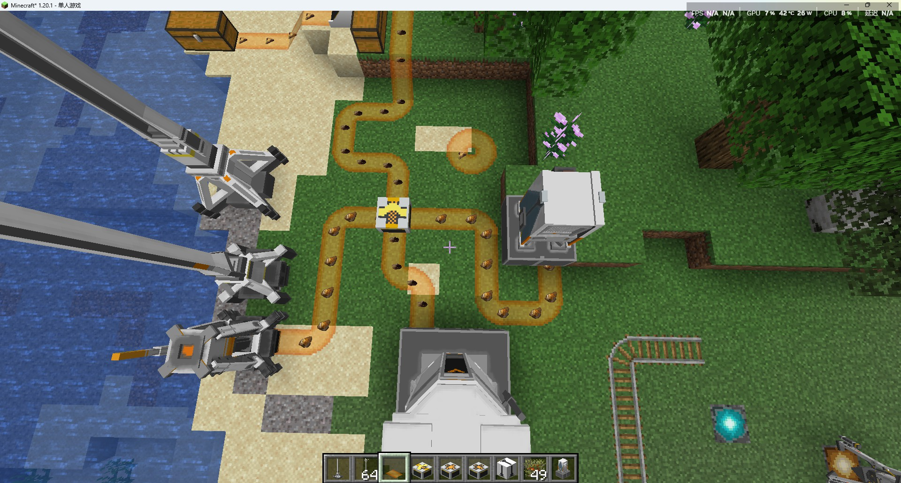
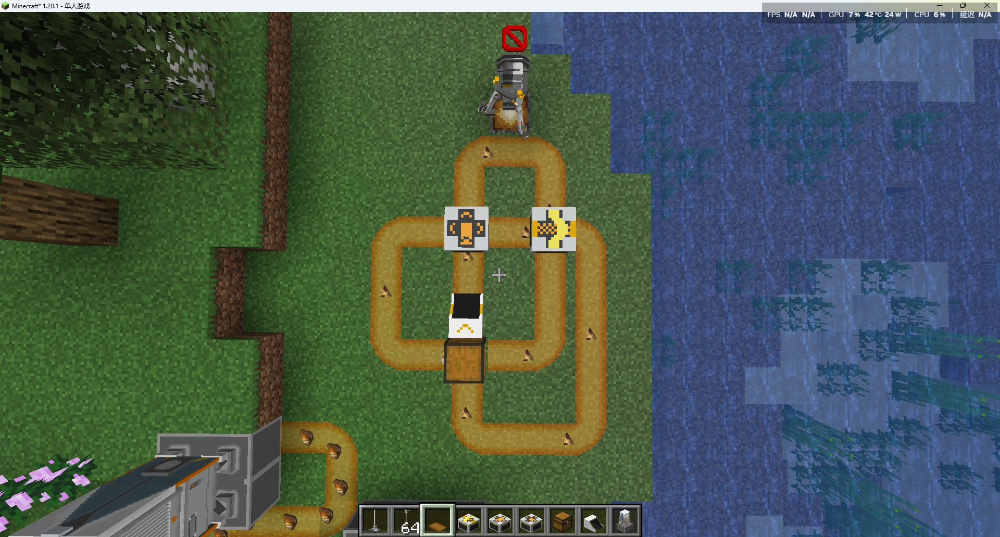
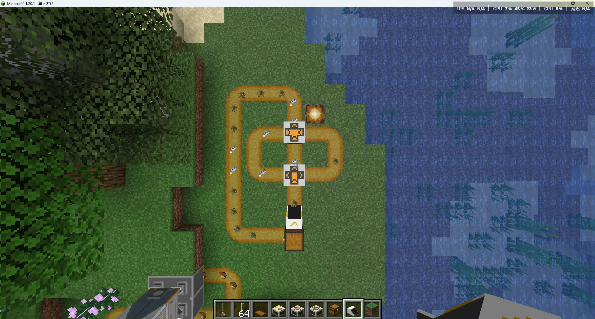

---
sidebar_position: 2
---

# 传送带辅助桥 / Belt Bridges

用于辅助传送带铺设的桥

Use Belt Bridges to help you place belts.

## 画廊 / Gallery

## 信息 / Information
### 物流桥 / Belt Bridge
可以让两条`相互交叉`的传送带互不干扰；

Can be used to prevent the two belts from interfering with each other.

### 分流器 / Splitter
可以将一条传送带上的物品`分流`到最多3条传送带上；

Can be used to `split` the items on a belt into up to 3 belts.

### 汇流器 / Converger
可以将3条传送带上的物品`合并`到一条传送带上；

Can be used to `merge` the items on 3 belts into one belt.

## Tips
各种桥都具有`朝向`，放置时注意运输方向；

All bridges have a `direction`, please pay attention to the transport direction when placing.

## 技术性说明 / Technical Explanation
各种桥的逻辑由`传送带`触发，本身不具备`tick`逻辑，比如：
- 传送带向前推送时，推送方向上是一个分流器；
- 那么当该传送带上的物品运输到该传送带末端时，触发分流器的转运逻辑，将该传送带上的物品直接转运给另外的传送带；
- 转运过程为瞬间完成；

所以，目前的桥无法像终末地原作那样紧挨着放置；

All bridges are triggered by `Belt`, which does not have `tick` logic, such as:
- When a `Belt` pushes forward, the direction of the `Belt` is a `Splitter`;
- When the item is transported to the end of the `Belt`, the transfer logic of the `Splitter` is triggered, and the item is directly transferred to another `Belt`;
- The transfer process is completed instantly.

Therefore, the current bridge cannot be placed next to each other like in the original game Endfield