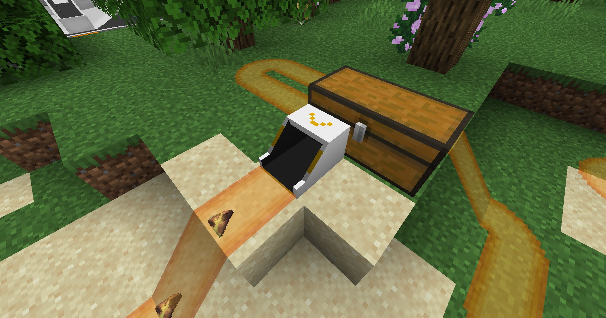

---
sidebar_position: 3
---

# 输出端口 / Output Port

主动从其他方块中取出物品，并推送给传送带的方块

Active transferring items from other blocks to the block connected to the belt

## 画廊 / Gallery

## 信息 / Information
- 输出端口可以`主动抽取`其他容器中的物品，并推送给传送带；

  The output port can `actively extract` items from other containers and push them to the block connected to the belt;

- 输出端口的方块朝向是向传送带推送的方向；

  The block facing the output port is the direction to push to the belt;

- 它的抽取逻辑是按容器内物品的`顺序`进行抽取的，未来实装筛选功能；

  Its extraction logic is to extract items in the order of the items in the container, and the future implementation of filtering function;

- 对于`协议核心`的物品输出，可使用`协议核心端口`来筛选输出物品

  For `Protocol Core` item output, you can use `Protocol Core Port` to filter output items

## Tips
输出端口具有朝向，其开口方向是向传送带推送的方向；

The output port has a direction, the opening direction is the direction of the push to the belt;