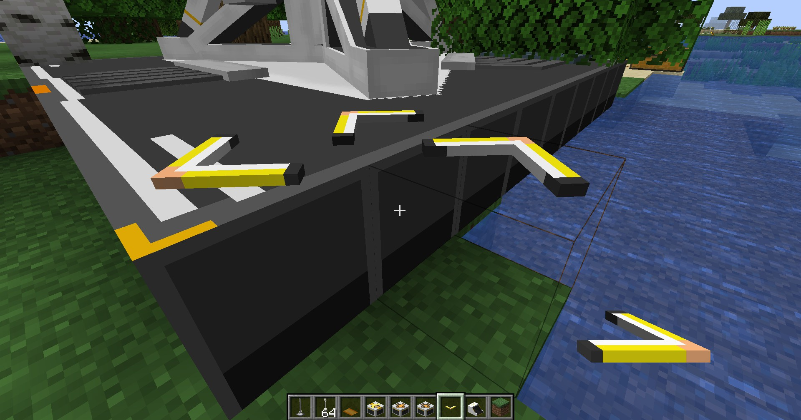

---
sidebar_position: 4
---

# 协议核心端口 / Protocol Core Port

放置在协议核心周围，辅助输入输出协议核心的物品

Placed around the protocol core, auxiliary input output items for the protocol core

## 画廊 / Gallery

## 信息 / Information
- 协议核心端口需要放置在`协议核心底座范围内`，其底座除了中央方块外，都可以`破坏`并放置端口；

  Protocol Core Port needs to be placed `within the range of the protocol core base`, except for the central block, which can be `destroyed` and placed port;

- 在底座范围内才能找到`中央方块实体`，即协议核心本身，继而正常运作；

  In order to find the `central block entity` within the base range, that is, the protocol core itself, and then operate normally;

- 端口的输出有筛选功能，详见下方的`Tips`

  The output of the port has filtering capabilities, see the `Tips` below

## Tips
输出端口具有朝向，其箭头方向为运输方向；即箭头朝外，则为输出；朝内，则为输入；

Protocol Core Port output has a direction, the arrow direction is the shipping direction; that is, the arrow points outwards, indicating output;

输出端口的筛选功能，即：
- 拿着一个`物品`右键，设置输出物品为该物品；
- `空手`右键，可打开协议核心的GUI；
- `Shift` + `空手`右键，取消筛选条件；

Output port filtering function, that is:
- Holding an `item` right-click, set the output item to that item;
- Right-click with an `empty hand`, open the protocol core GUI;
- `Shift` + Right-click with an `empty hand`, cancel the filtering condition;

## 技术性说明 / Technical Explanation
协议核心端口本身是为了可以让玩家自由配置协议核心上的输入输出端口，因为终末地原作的确实不好用；

Protocol Core Port itself is designed to allow players to configure input and output ports on Protocol Core, because the original design is not very convenient;
