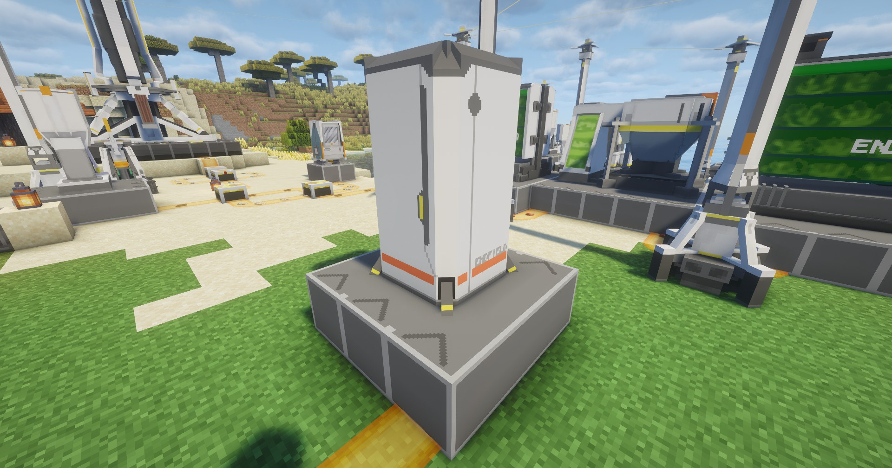

---
sidebar_position: 10
---

# 协议储存箱 / Protocol Stash
每隔一段时间自动向全局仓库管理系统提交物品

Automatically submit items to the Global Storage Manager at regular intervals

## 画廊 / Gallery

## 信息 / Information
- 本身不需要消耗电力，可通电或不通电

  It does not consume electricity, can be connected or disconnected

- 在通电情况下，每隔`10秒`将自动提交存储的物品到`全局仓储管理系统`中，关于此内容参见[全局仓储管理系统](global-storage-manager.md)

  In the case of power-on, the stored items will be automatically submitted to the 'Global Storage Manager' every '10 seconds', for this content, see [Global Storage Manager](../logistics-units/global-storage-manager.md)  

- 在不通电的情况下，可作为一个普通的箱子

  In the case of no power, it can be used as a normal chest

- 自身的存储容量为`27`个，与原版的箱子一致

  It has a storage capacity of `27`, consistent with Minecraft's chest

## Tips
- 可通过`制造台`制作，相关介绍见[制作台](../production1/crafter.md)；

  It can be made through the Crafter, see [Crafter](../production1/crafter.md) for details;

- 它的输入输出方向没有做限制，但最好依据贴图指示方向来放置，以达到最好的效果
  
  The input and output directions of this machine are not restricted, but it is best to place it according to the direction indicated on the map to achieve the best effect

- 放置`协议储存箱`需要`3×3`的空地

  Placing a Protocol Stash requires an empty `3×3` area
