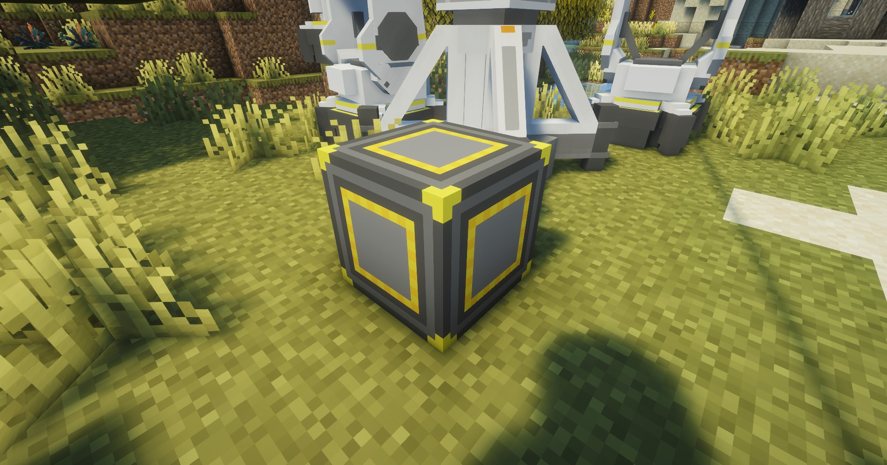
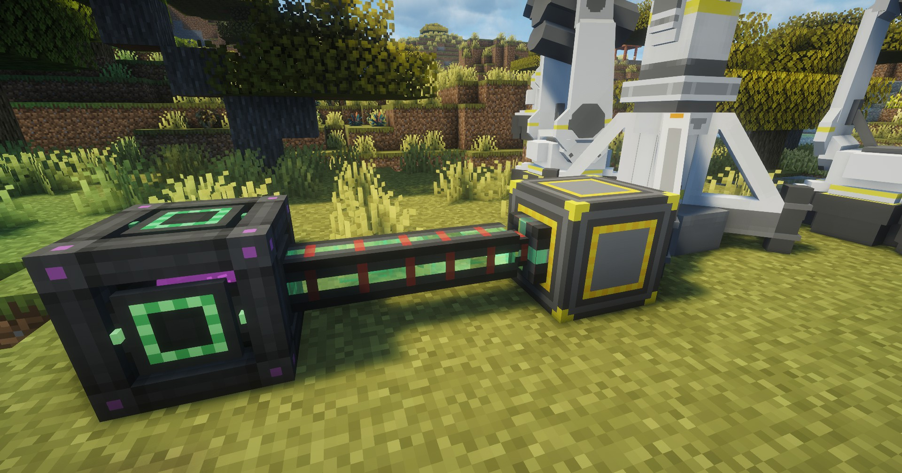

---
sidebar_position: 7
---
# FE转换器 / FE Converter
将终末地的EFU转换为Forge Energy的工业设备；Forge与NeoForge版本特供；

It converts EFU to Industrial devices in Thermal Expansion; Forge and NeoForge versions are specially provided;

## 画廊 / Gallery

## 信息 / Information
- FE转换器`需要电力`才能工作，耗电量为`50 EFU`；

  FE Converter needs power to work, power consumption is `50 EFU`;

- FE转换器自身可以缓存`10000 EFU`，但其充能速度不享受`20倍`的充电速度，见[特性](../features.md)；

  FE Converter can cache `10000 EFU`, but its charging speed does not enjoy `20 times` of charging speed, see [Features](../features.md);

- 转换比例为`1 EFU = 325 FE`；每tick可输出`16.25k FE`；

  Conversion ratio is `1 EFU = 325 FE`; Each tick can output `16.25k FE`;

## Tips
只能主动抽取其中存储的`FE`，请使用像`MEK`里面的`电缆`；

Can only actively extract the stored `FE`; Please use like `MEK`'s `cable`;

