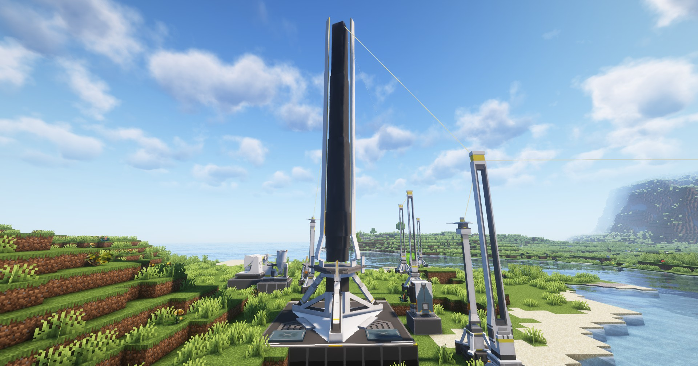

---
sidebar_position: 1
---

# 协议核心 / Protocol Core

一切的开始，集成工业的核心

The beginning of everything, the core of the AIC

## 画廊 / Gallery

## 信息 / Information
- 本身能够提供`200 EFU`（本模组使用的电力单位为EFU，即Endfield Units）的电力，所有用电设备所需的电力均来自协议核心（还有个热能池）；

  It provides `200 EFU` of electricity, all the electricity required for the use of the device is provided by the protocol core (and the Thermal Bank).

- 不能合成，玩家第一次进入存档会自动获得一个协议核心（别乱扔，没了就开创造理赔吧）；

  Cannot be synthesized, the first time the player enters the archive will automatically obtain a protocol core (don't throw it away, if there is no power, open the claim for creation).

- 协议核心内置容量`100000 EFU`电力的电池，在发电功率小于用电功率时，会消耗电池的电能；反之则充能；
  
  Protocol Core built-in capacity `100000 EFU` battery, when the power of the generation is less than the power of the consumption, the energy of the battery will be consumed; otherwise, it will be charged;

- 协议核心依赖`全局电网`工作，详细参见[全局电网](../powering/global-power-network.md)

  Protocol Core depends on `Global Power Network` to work, see [Global Power Network](../powering/global-power-network.md) for details

## Tips
强烈建议直接将`协议核心`放置在你的出生点区块附近，或者将`协议核心`所在区块设定为`常加载区块`，以保证电力系统的运行

It is strongly recommended to place the `Protocol Core` near your birth point chunk or set the chunk where the `Protocol Core` is located as a `Ticking area` to ensure the operation of the electricity system

曾经协议核心与其他工业设备可以当作`盾构机`使用，因为放置时会直接破坏周围方块，不论是什么；但自0.1.8-beta起，放置时如果空间不够则无法放置；

Protocol Core can be used as a `Shield Machine` before, because it will destroy the surrounding blocks when placed, regardless of what it is; But from 0.1.8-beta, it cannot be placed if there is not enough space;

协议核心底座上的方块，除了中央的方块外，都可以破坏，然后放置`协议核心端口`，参见[协议核心端口](../logistics-units/protocol-core-port.md)

Blocks on the protocol core base, except for the central one, can be destroyed, and then 'protocol core ports' are placed, see [Protocol Core Port](../logistics-units/protocol-core-port.md)
