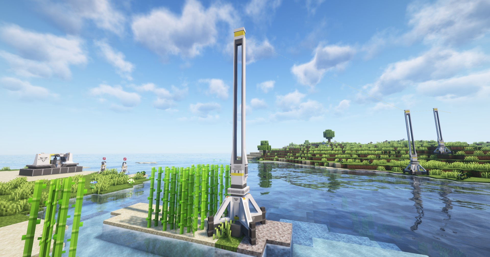

---
sidebar_position: 4
---
# 中继器 / Relay Tower

用于中继电力，将电力运输到其他地方

Used to relay electricity, transport electricity to other places

## 画廊 / Gallery

## 信息 / Information
- 本身不发电，也不耗电，只中转电力；

  It does not generate electricity or consume electricity, only relay electricity;

- 可提供一定范围的供电，可供放置在其半径`10`米范围内的用电工业设备工作；

  It can provide a certain range of power, which can be used by electricity-powered devices placed within its radius `10` meters.

- 放置中继器时，它会自动获取`全局电网节点管理系统`中最近的节点进行连接（80米范围内），如果找到，则会自动连接该节点；

  When placing a relay tower, it will automatically obtain the nearest node from the `Global Network Node Manager` (within 80 meters), and if found, it will automatically connect to that node.

## Tips
- `右键`中继器，可获取当前电网的信息；

  `Right-click` the relay tower, you can get the information of the current power grid;

- 如果中继器连接的节点被移除了，那么中继器会在断开后，获取`全局电网节点管理系统`中的节点信息，每隔1s尝试自动重连其他节点；

  If the node connected to the relay tower is removed, then the relay tower will get the node information from the `Global Network Node Manager` after disconnection, and try to automatically reconnect to other nodes every 1s.

- 已知特性（即所谓的bug）：
## 技术性说明 / Technical Explanation
原作游戏中（四号谷地）是手动拉电线的，但那玩意确实不好使；

最重要是武陵地区变成了自动连接，这就导致模组处在了一个尴尬的位置上；

如果写两种，那么玩家可能会更倾向于使用自动连接，因为方便；

于是，经过斟酌，模组全部采用自动连接，但我会在未来添加一个物品，可用于局部重连一些节点；

In the original game (Valley IV), the electricity lines are manually pulled, but that thing is not very useful;

The most important thing is that the Wu Ling area has become automatic connection, which leads to a position of awkwardness for the mod;

If I write two, players may prefer to use automatic connection because it is more convenient;

Therefore, after considering, the mod will completely adopt automatic connection, but I will add an item in the future for local reconnection of some nodes.

## 未来计划 / Future Plans
考虑到未来会新增`武陵`地区的`息壤中继器`等内容，所以我正在考虑削减该中继器的连接范围，比如从80米削减至40米；

亦或是直接使用未来添加的物品来手动拉电线；

Considering that the `Wuling` region will add `Xiranite Relay` and other content in the future, I am considering reducing the connection range of this relay tower, such as reducing from 80 meters to 40 meters;

Or directly use the item added in the future to manually pull the electricity line;