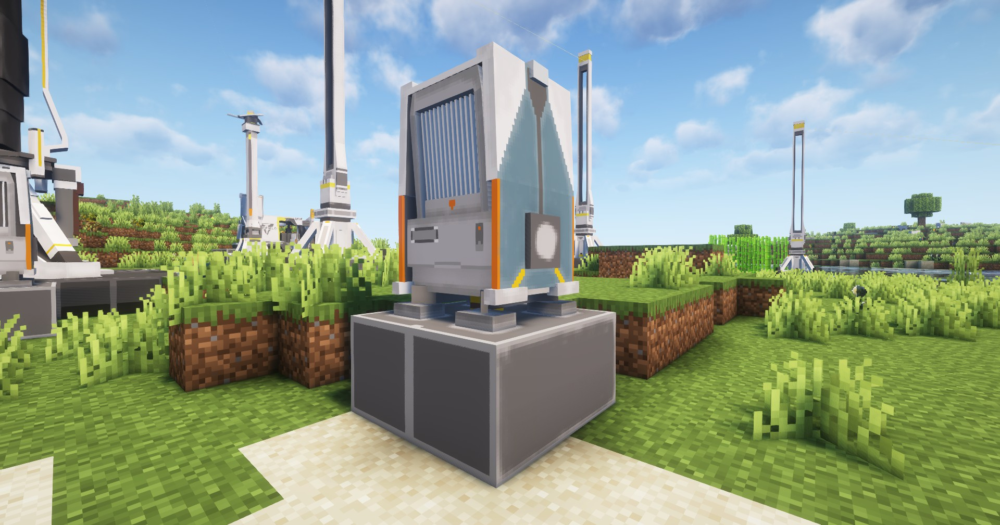

---
sidebar_position: 6
---
# 热能池 / Thermal Bank
发电设备，为电网提供额外电力；

Power generating device, providing extra electricity to the power network;

## 画廊 / Gallery

## 信息 / Information
- 发电设备，在用电功率超过`协议核心`的发电功率时，可使用`热能池`进行发电；

  Power generating device, which can generate electricity when the power consumption exceeds `Protocol Core`'s power consumption;

- 可燃烧`Minecraft`的所有可作为燃料的物品，但发电量固定为`150 EFU`；
  
  It can be burned all the items that can be used as fuel in `Minecraft`, but the power consumption is fixed at `150 EFU`;

- 可燃烧`源石`、`低容电池`、`中容电池`和`高容电池`，各发电量见物品的描述；

  It can be burned `Originium ore`, `LC Battery`, `SC Battery` and `HC Battery`, see the description of each item;

## Tips
- 可使用`传送带`自动向热能池输入物品

  It can be used to automatically input items into the thermal bank using `Belt`

- 放置`热能池`需要`2×2`的空地

  Placing a thermal bank requires an empty `2×2` area