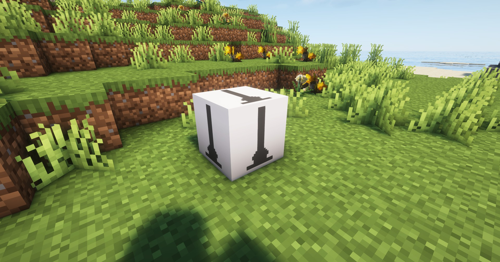

---
sidebar_position: 1
---

# 制造台 / Crafter

用来制造各种工业设备的平台

It is a platform for making various industrial devices

## 画廊 / Gallery


## 信息 / Information
- 制造台`不需要电力`即可工作；

  Crafter does not need electricity to work;

- 合成方式类似于`工作台`，相关配方见`JEI`或`REI`；

  Synthetic method is similar to `Crafting Table`, related recipes see `JEI` or `REI`;

- 功能本身是从`协议核心`的`设备制造`中分离出来的；

  The function itself is extracted from the `facility construction` of `protocol core`;

## 技术性说明 / Technical Explanation
为什么把设备制造这个功能从协议核心分离出来呢？

首先，我的水平有限，好几个功能塞一起不一定能很好地运行，维护可能也会有麻烦，与其让它带着bug运行不如分离出来；

然后，由于模组的开发不同于一般的游戏开发，最好能保证一个方块实体对应一种职责，多功能的方块逻辑到后面可不好折腾（个人观点）；

所以还是分离了功能，但未来的流体工业，我会想办法让它尽量合在一起。

Why was the equipment manufacturing feature separated from the Protocol Core?

First, my skills are limited, and cramming several features together might not work well, and maintenance could become a hassle. Rather than letting it run with bugs, I decided to separate it;

Second, since mod development differs from general game development, it’s best to ensure that each block entity corresponds to a single responsibility. Multi-functional block logic can become a real headache down the line (in my opinion);

So I’ve separated the functions for now, but for the future Fluid Industry, I’ll find a way to integrate them as much as possible.

## 相关配方 / Related Recipes
你可自定义数据包来拓展制造台能加工的东西；

You can customize the data pack to expand the things that the Crafter can process;

### 示例 / Example：
```json
{
  "type": "arknights_endfield:crafter",
  "input": {
    "arknights_endfield:originium_ore": 5
  },
  "output": {
    "count": 1,
    "item": "arknights_endfield:refining_unit"
  }
}
```

参数说明 / Parameter Description:
- `input`: 输入物品和数量 / Input items and number;
- `output`: 合成物品和数量 / Output items and number;
