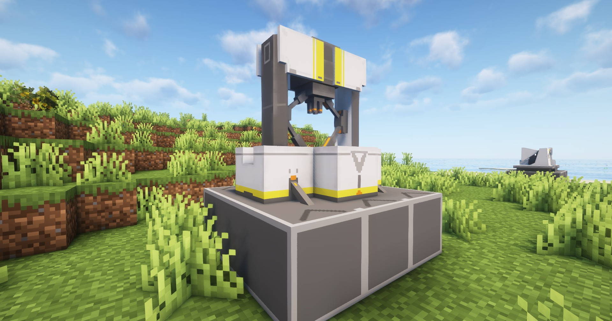

---
sidebar_position: 5
---

# 塑形机 / Moulding Unit

能够冲压各种容器的设备

A facility that produces various containers via stamp moulding

## 画廊 / Gallery


## 信息 / Information
- 塑形机`需要电力`才能工作，耗电量为`10 EFU`；

  Moulding Unit needs power to work, power consumption is `10 EFU`;

- 每`2秒`加工一个物品，相关配方见`JEI`或`REI`；

  Each `2 seconds` process one item, related recipes see `JEI` or `REI`;

## Tips
- 可通过`制造台`制作，相关介绍见[制作台](crafter.md)；

  It can be made through the Crafter, see [Crafter](crafter.md) for details;

- 放置`塑形机`需要`3×3`的空地

  Placing a Moulding Unit requires an empty `3×3` area

## 相关配方 / Related Recipes
你可自定义数据包来拓展塑形机能加工的东西；

You can customize the data pack to expand the things that the Moulding Unit can process;

### 示例 / Example：
```json
{
  "type": "arknights_endfield:moulding_unit",
  "input": {
    "count": 2,
    "item": "arknights_endfield:amethyst_fiber"
  },
  "output": {
    "count": 1,
    "item": "arknights_endfield:amethyst_bottle"
  }
}
```

参数说明 / Parameter Description:
- `input`: 输入物品和数量 / Input items and number;
- `output`: 合成物品和数量 / Output items and number;