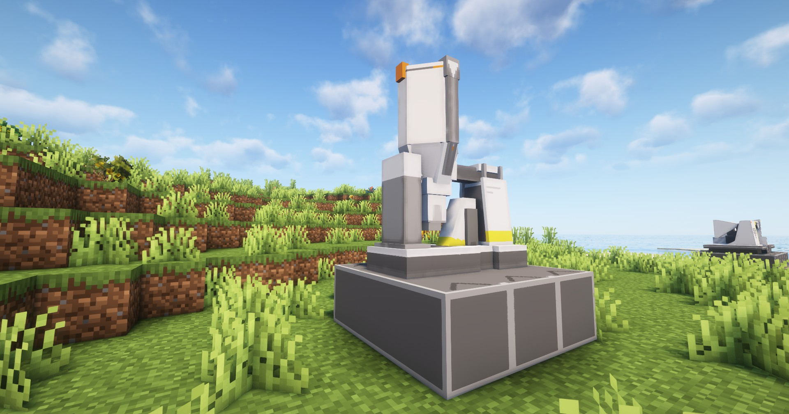

---
sidebar_position: 2
---

# 精炼炉 / Refining Unit

使用高温精炼其他材料的设备

A facility that performs high temperature refining of various materials

## 画廊 / Gallery

*尚未修改的模型版本，参考再次测试*

## 信息 / Information
- 精炼炉`需要电力`才能工作，耗电量为`5 EFU`；

  Refining Unit needs power to work, power consumption is `5 EFU`;

- 每`2秒`加工一个物品，相关配方见`JEI`或`REI`；

  Each `2 seconds` process one item, related recipes see `JEI` or `REI`;

## Tips
- 可通过`制造台`制作，相关介绍见[制作台](crafter.md)；

  It can be made through the Crafter, see [Crafter](crafter.md) for details;

- 放置`精炼炉`需要`3×3`的空地

  Placing a Refining Unit requires an empty `3×3` area

## 相关配方 / Related Recipes
你可自定义数据包来拓展精炼炉能加工的东西；

You can customize the data pack to expand the things that the Refining Unit can process;

### 示例 / Example：
```json
{
  "type": "arknights_endfield:refining_unit",
  "input": {
    "count": 1,
    "item": "arknights_endfield:amethyst_ore"
  },
  "output": {
    "count": 1,
    "item": "arknights_endfield:amethyst_fiber"
  }
}
```

参数说明 / Parameter Description:
- `input`: 输入物品和数量 / Input items and number;
- `output`: 合成物品和数量 / Output items and number;