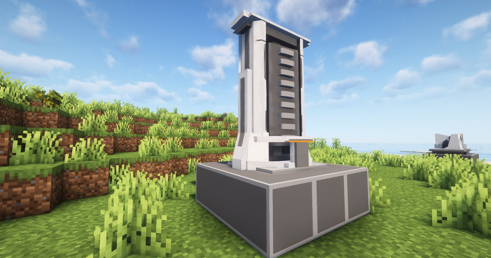

---
sidebar_position: 3
---

# 粉碎机 / Shredding Unit

能粉碎各种材料的重型设备

A heavy facility that shreds and pulverizes various materials

## 画廊 / Gallery


## 信息 / Information
- 粉碎机`需要电力`才能工作，耗电量为`5 EFU`；

  Shredding Unit needs power to work, power consumption is `5 EFU`;

- 每`2秒`加工一个物品，相关配方见`JEI`或`REI`；

  Each `2 seconds` process one item, related recipes see `JEI` or `REI`;

## Tips
- 可通过`制造台`制作，相关介绍见[制作台](crafter.md)；

  It can be made through the Crafter, see [Crafter](crafter.md) for details;

- 放置`粉碎机`需要`3×3`的空地

  Placing a Shredding Unit requires an empty `3×3` area

## 相关配方 / Related Recipes
你可自定义数据包来拓展粉碎机能加工的东西；

You can customize the data pack to expand the things that the Shredding Unit can process;

### 示例 / Example：
```json
{
  "type": "arknights_endfield:shredding_unit",
  "input": {
    "item": "arknights_endfield:buckflower"
  },
  "output": {
    "count": 2,
    "item": "arknights_endfield:buckflower_powder"
  }
}
```

参数说明 / Parameter Description:
- `input`: 输入物品 / Input items;
- `output`: 合成物品和数量 / Output items and number;