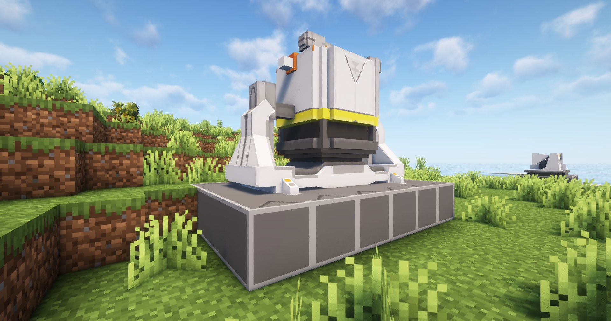

---
sidebar_position: 3
---

# 研磨机 / Grinding Unit

可以对粉末材料进行细致研磨处理的设备

A facility that performs fine grinding of powdered materials

## 画廊 / Gallery


## 信息 / Information
- 研磨机`需要电力`才能工作，耗电量为`50 EFU`；

  Grinding Unit needs power to work, power consumption is `50 EFU`;

- 每`2秒`加工一个物品，相关配方见`JEI`或`REI`；

  Each `2 seconds` process one item, related recipes see `JEI` or `REI`;

## Tips
- 可通过`制造台`制作，相关介绍见[制作台](../production1/crafter.md)；

  It can be made through the Crafter, see [Crafter](../production1/crafter.md) for details;

- 放置`研磨机`需要`6×4`的空地

  Placing a Grinding Unit requires an empty `6×4` area

## 相关配方 / Related Recipes
你可自定义数据包来拓展研磨机能加工的东西；

You can customize the data pack to expand the things that the Grinding Unit can process;

### 示例 / Example：
```json
{
  "type": "arknights_endfield:grinding_unit",
  "input": [
    {
      "count": 2,
      "item": "arknights_endfield:amethyst_powder"
    },
    {
      "count": 1,
      "item": "arknights_endfield:sandleaf_powder"
    }
  ],
  "output": {
    "count": 1,
    "item": "arknights_endfield:cryston_powder"
  }
}
```

参数说明 / Parameter Description:
- `input`: 输入物品和数量 / Input items and number;
- `output`: 合成物品和数量 / Output items and number;