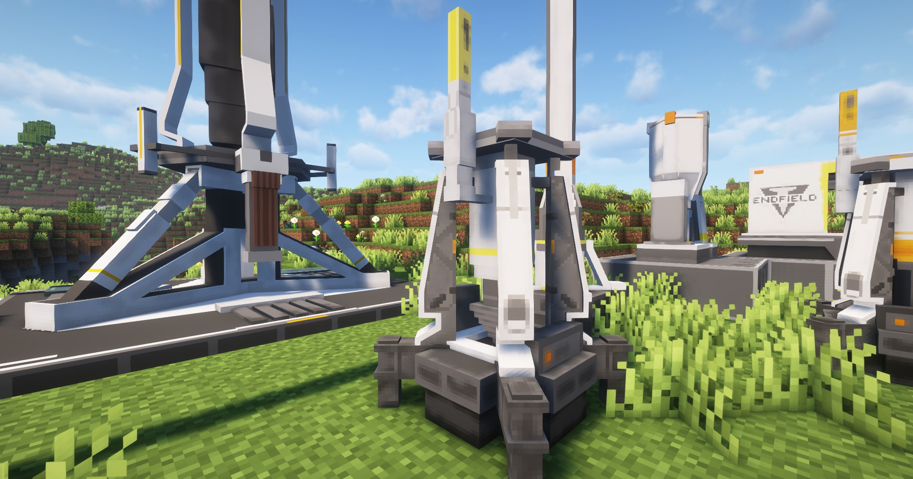

---
sidebar_position: 2
---

# 电驱矿机 / Electric Mining Rig

高级一些的矿机，需要电力才能工作

More advanced mining rig, need power to work

## 画廊 / Gallery


## 信息 / Information
- 电驱矿机`需要电力`即可工作，耗电量为`5 EFU`；

  Electric Mining Rig can work with `power`, consuming `5 EFU`;

- 必须放置在`矿脉方块`上才能工作，矿脉参见[矿脉](../resourcing/ore-vine.md)；

  Must be placed on `Mineral Vine Block` to work, see [Ore Vine](../resourcing/ore-vine);

- 可开采大多数矿脉方块，但不能开采`蓝铁矿`、`赤铜矿`等更高等级的矿脉方块；

  Can mine most mineral vein blocks, but cannot mine `Ferrium Mineral Vein Block`, `Cuprium Mineral Vein Block` and other higher-level mineral vein blocks;

- 每`3秒`开采一个矿石

  Each `3 seconds` mine one ore;

## 相关配方 / Related Recipes
你可自定义数据包来拓展矿机能开采的东西；

You can customize the data pack to expand the things that the mine can mine;

### 示例 / Example：
```json
{
  "type": "arknights_endfield:ore_rig",
  "input": {
    "item": "arknights_endfield:amethyst_mineral_vein_block"
  },
  "output": {
    "count": 1,
    "item": "arknights_endfield:amethyst_ore"
  },
  "tier": 2
}
```

参数说明 / Parameter Description:
- `input`: 矿脉方块 / Mineral Vine Block;
- `output`: 矿机所开采的矿石 / Ore mined by the mine;
- `tier`: 可开采该矿脉方块的最低矿机等级 / The lowest mine tier required to mine this mineral vine block;
  
其中，`tier`的`1`、`2`、`3`值分别指代`便携源石矿机`、`电驱矿机`和`二型电驱矿机`，以此类推

Among them, the `tier` value of `1`, `2`, and `3` represent `Portable Ferrium Mine`, `Electric Mining Rig`, and `Electric Mining Rig Mk II`, respectively, and so on
