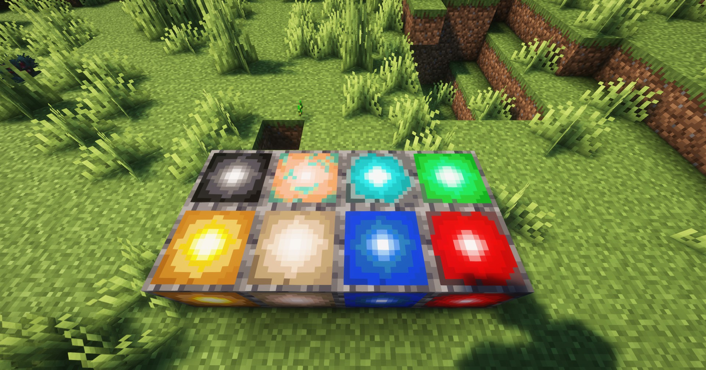
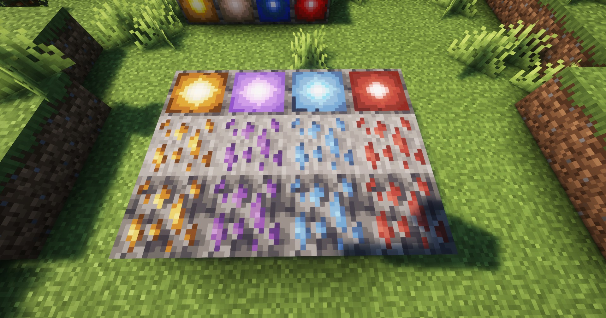
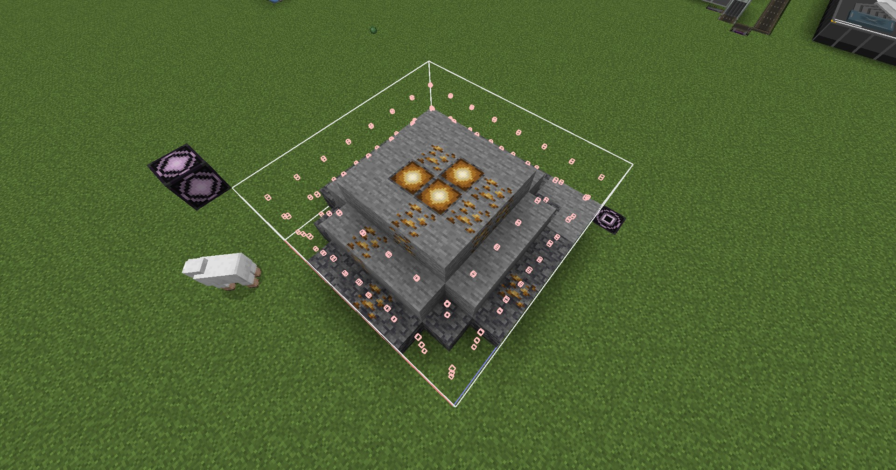
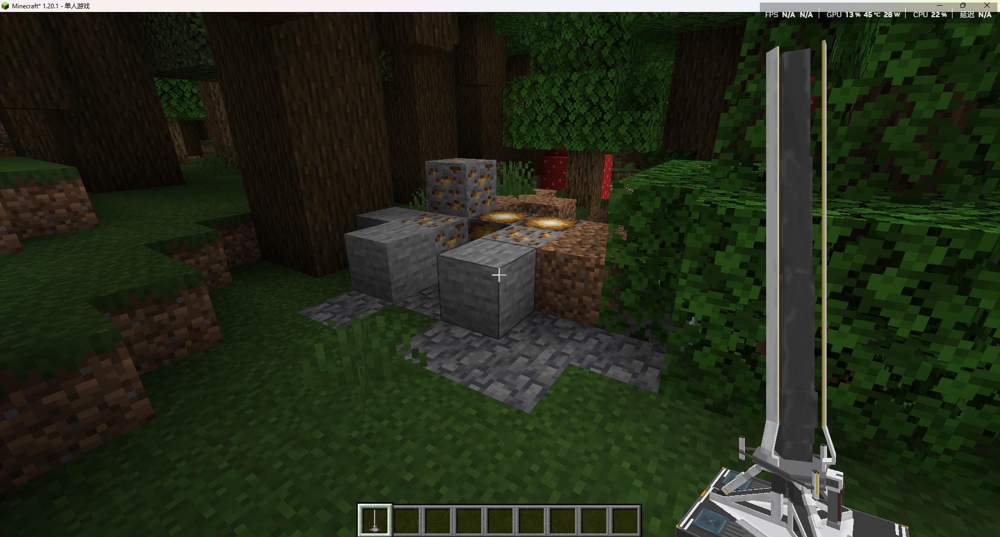

---
sidebar_position: 5
---

# 矿脉方块 / Mineral Vine Block

可供矿机开采的矿脉方块

Can be mined by mining rigs

## 画廊 / Gallery


↑ 为`Minecraft`原版矿石添加的矿脉方块；

↑ Mineral vein blocks added to the original `Minecraft` ore;


↑ `终末地`相关的矿脉方块；

↑ Mineral vein blocks related to `Endfield`;

## 信息 / Information
- 矿脉方块可生产无限的矿石；

  Mineral vein blocks can produce an unlimited amount of ore;

- 将矿机放置在矿脉方块上，就可以开采到相应的矿石；

  Place a Mining Rig on a mineral vein block to mine the corresponding ore;

- 矿脉方块及相关矿石方块会以`结构`的形式生成在自然世界中，详见下方的生成规则；

  The mineral vein block and related ore blocks will be generated in the natural world in the form of `structure`, see the generation rules below for details;

## 世界生成规则 / World Generation Rules

### Tips
> 目前所有矿石只会生成在主世界中，暂不出现在其他维度
> 
> Currently, all ores will only be generated in the Over World, and will not appear in other dimensions at present

### 基础样式 / Basic Style


> 第一层——普通矿石 + 矿脉方块（最多3个） + 石头
> 
> 第二层——普通矿石 + 石头
> 
> 第三层——深层矿石 + 深板岩

> 1st Layer—Common Ore + Mineral Vine Block (Maximum 3) + Stone
> 
> 2nd Layer—Common Ore + Stone
> 
> 3rd Layer—Deepslate Ore + Deepslate Stone

### 生成样例 / Generation Sample


### Minecraft 原版矿石 / Minecraft ores
- 仅在丛林生成；

  Only generates in Jungle;

- 平均生成间距`120`区块，最小生成间距`40`区块；

  Average generation interval `120` chunks, minimum generation interval `40` chunks;

相关文件 / Related Files：
- structure_set
    ```json
    {
      "structures": [
        {
          "structure": "arknights_endfield:diamond_ore",
          "weight": 1
        }
      ],
      "placement": {
        "type": "minecraft:random_spread",
        "salt": 1694767003,
        "spacing": 120,
        "separation": 40
      }
    }
    ```
  
- tags
    ```json
    {
      "replace": false,
      "values": [
        "#minecraft:is_jungle"
      ]
    }
    ```

### 终末地矿石 / Endfield ores
- 会生成在包括`丛林`、`平原`、`沙漠`等常规生物群系中；

  Will be generated in regular biome systems including `Jungle`, `Plains`, `Desert` etc.

- 平均生成间距`15`区块，最小生成间距`8`区块（紫晶矿最小生成间距为`12`区块）

  Average generation interval `15` chunks, minimum generation interval `8` chunks (The minimum generation interval of `Amethyst Ore` is `12` chunks)

相关文件 / Related Files：
- structure_set
    ```json
    {
      "structures": [
        {
          "structure": "arknights_endfield:originium_ore",
          "weight": 1
        }
      ],
      "placement": {
        "type": "minecraft:random_spread",
        "salt": 1694767009,
        "spacing": 15,
        "separation": 8
      }
    }
    ```

- tags
    ```json
    {
      "replace": false,
      "values": [
        "#minecraft:is_jungle",
        "#minecraft:is_forest",
        "#minecraft:is_taiga",
        "minecraft:desert",
        "minecraft:plains",
        "minecraft:snowy_plains",
        "minecraft:sunflower_plains",
        "minecraft:savanna",
        "minecraft:savanna_plateau",
        "minecraft:windswept_savanna"
      ]
    }
    ```
  