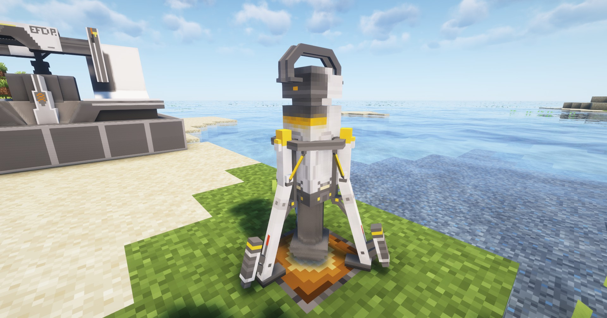

# 便携源石矿机 / Portable Originium Rig

最基本的矿机，可开采源石、煤炭和红石

The basic rig, can mine originium, coal and redstone.

## 画廊 / Gallery


## 信息 / Information
- 便携源石矿机`不需要电力`即可工作；
    
  Portable Originium Rig `does not require power` to work;

- 必须放置在`矿脉方块`上才能工作，矿脉参见[矿脉](../resourcing/ore-vine.md)；

  Must be placed on `Mineral Vine Block` to work, see [Ore Vine](../resourcing/ore-vine);

- 可开采`源石`、`煤炭`以及`红石`；

  Can mine `Originium Ore`, `Coal Ore` and `Redstone Ore`;

- 每`3秒`开采一个矿石

  Each `3 seconds` mine one ore;

## 相关配方 / Related Recipes
你可自定义数据包来拓展矿机能开采的东西；

You can customize the data pack to expand the things that the mine can mine;

### 示例 / Example：
```json
{
  "type": "arknights_endfield:ore_rig",
  "input": {
    "item": "arknights_endfield:originium_mineral_vein_block"
  },
  "output": {
    "count": 1,
    "item": "arknights_endfield:originium_ore"
  },
  "tier": 1
}
```

参数说明 / Parameter Description:
- `input`: 矿脉方块 / Mineral Vine Block;
- `output`: 矿机所开采的矿石 / Ore mined by the mine;
- `tier`: 可开采该矿脉方块的最低矿机等级 / The lowest mine tier required to mine this mineral vine block;

其中，`tier`的`1`、`2`、`3`值分别指代`便携源石矿机`、`电驱矿机`和`二型电驱矿机`，以此类推

Among them, the `tier` value of `1`, `2`, and `3` represent `Portable Ferrium Mine`, `Electric Mining Rig`, and `Electric Mining Rig Mk II`, respectively, and so on
